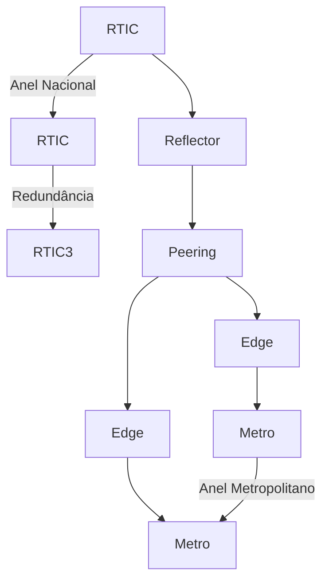
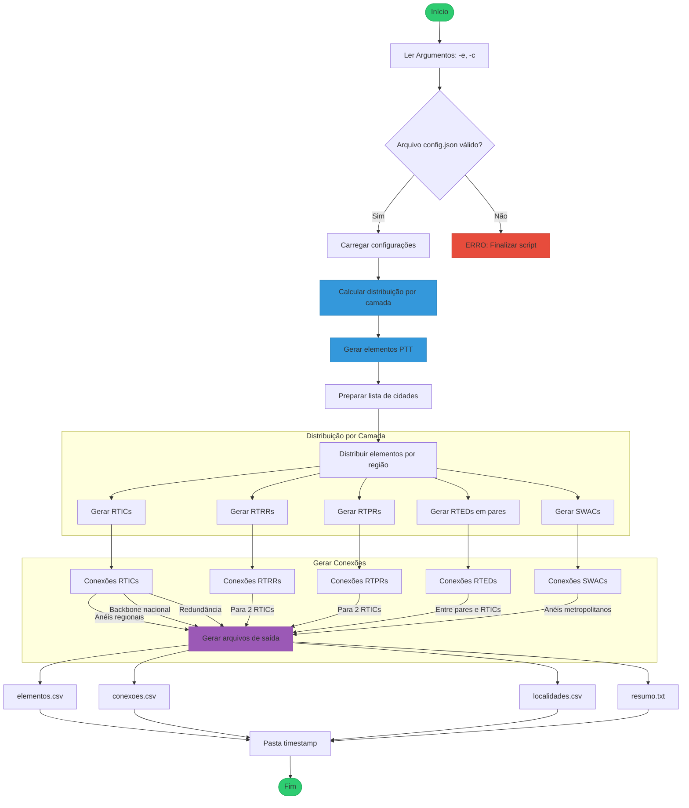

# 🌐 Gerador de Topologias para Backbone Nacional

[](https://opensource.org/licenses/MIT)


Ferramenta para geração automatizada de topologias hierárquicas de redes backbone nacionais, produzindo datasets prontos para visualização em ferramentas como Draw.io.

## 🔍 Visão Geral

Gera três arquivos essenciais para modelagem de redes:
- `elementos.csv`: Equipamentos e atributos
- `conexoes.csv`: Interconexões entre dispositivos
- `localidades.csv`: Dados geográficos (coordenadas em DMS)

## ⚙️ Instalação Rápida das dependências para execução do script

```bash
# Windows (via Microsoft Store)
1. Abra Microsoft Store
2. Busque "Python 3.12+"
3. Clique em Instalar

# Linux (Debian/Ubuntu)
sudo apt update && sudo apt install python3 -y
```

## 🚀 Como Usar

**Comando básico:**
```bash
python GeradorBackbone.py -e 300
```

**Opções:**
| Argumento | Descrição                          | Padrão   |
|-----------|------------------------------------|----------|
| `-e`      | Total de elementos (30-1000)      | 300      |
| `-c`      | Caminho do arquivo de configuração | config.json |

**Exemplos:**
```bash
# Topologia padrão (300 elementos)
python GeradorBackbone.py

# Topologia personalizada (500 elementos)
python GeradorBackbone.py -e 500 -c meu_config.json
```

## 📂 Estrutura de Arquivos

### Arquivo de Configuração (`config.json`)
```json
{
  "PROPORCAO_CAMADAS": {
    "RTIC": 0.02,
    "RTRR": 0.03,
    "RTPR": 0.03,
    "RTED": 0.12,
    "SWAC": 0.80
  },
  "PROPORCOES_REGIAO": {
    "Norte": 0.083,
    "Nordeste": 0.289,
    "Centro-Oeste": 0.076,
    "Sudeste": 0.432,
    "Sul": 0.120
  },
  "PTTS": [
    ["São Paulo", "SP", -23.533773, -46.625290],
    ["Rio de Janeiro", "RJ", -22.911013, -43.209372]
  ]
}
```

### Saída Gerada
Pasta no formato `TOPOLOGIA_[QTD]_[TIMESTAMP]` contendo:
```
📁 TOPOLOGIA_300_20250702120000/
├── 📄 elementos.csv    # Equipamentos e atributos
├── 📄 conexoes.csv     # Interconexões
├── 📄 localidades.csv  # Coordenadas geográficas
└── 📄 resumo.txt       # Estatísticas da topologia
```

## 🏗️ Arquitetura da Topologia

### Hierarquia de 5 Camadas
| Camada         | Elemento | Proporção | Função Principal               |
|----------------|----------|-----------|--------------------------------|
| Inner-Core     | RTIC     | 2%        | Núcleo de alta capacidade      |
| Reflector      | RTRR     | 3%        | Agregação regional             |
| Peering        | RTPR     | 3%        | Interconexão com IXPs          |
| Edge           | RTED     | 12%       | Borda de rede                  |
| Metro          | SWAC     | 80%       | Acesso metropolitanos          |

### Princípios de Conectividade


## ⚠️ Limitações Conhecidas
1. Quantidade mínima de 30 elementos
2. Não considera topografia física (rios/montanhas)
3. Capacidade de enlace não modelada
4. Máximo recomendado: 1000 elementos

## 🛠️ O Que Este Projeto Não É
- Gerador visual de diagramas (.drawio)
- Simulador de desempenho de rede
- Ferramenta de planejamento de capacidade
- Validador de configurações de equipamentos

## 📊 Exemplo de Saída (resumo.txt)
```
RESUMO DA TOPOLOGIA GERADA
==========================
Elementos: 300
Conexões: 850

DISTRIBUIÇÃO:
------------
RTIC (Inner-Core): 6
RTRR (Reflector): 9 
RTPR (Peering): 9
RTED (Edge): 36
SWAC (Metro): 240

REGIÕES:
--------
Sudeste: 130 (43.3%)
Nordeste: 87 (29.0%)
Sul: 36 (12.0%)
Norte: 25 (8.3%)
Centro-Oeste: 22 (7.3%)
```

## 📌 Dicas Práticas
1. Combine com [GeradorTopologias](https://github.com/flashbsb/Network-Topology-Generator-for-Drawio) para visualização
2. Para >800 elementos, ajuste parâmetros de layout
3. Use `localidades.csv` para integração com mapas

## Fluxo do Programa



🔗 **Repositório Oficial**:  
https://github.com/flashbsb/Backbone-Network-Topology-Generator

📜 **Licença**:  
[MIT License](https://raw.githubusercontent.com/flashbsb/Backbone-Network-Topology-Generator/main/LICENSE)
```
