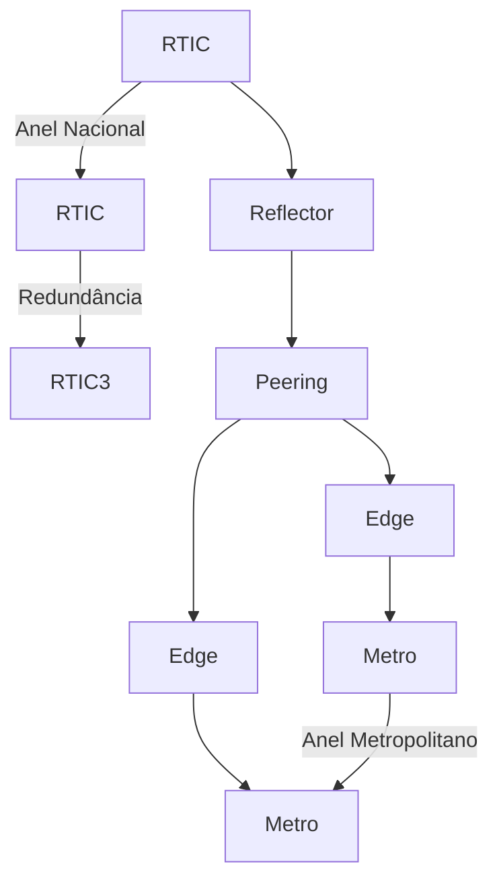

# 🌐 Gerador de Topologias para Backbone Nacional

[](https://opensource.org/licenses/MIT)


Ferramenta para geração automatizada de topologias hierárquicas de redes backbone nacionais, produzindo datasets prontos de laboratório para visualização em ferramentas como Draw.io.

## 🔍 Visão Geral

Gera três arquivos essenciais para modelagem de redes:
- `elementos.csv`: Equipamentos e atributos
- `conexoes.csv`: Interconexões entre dispositivos
- `localidades.csv`: Dados geográficos (coordenadas em DMS)

## ⚙️ Instalação das dependências para execução do script

# Windows (via Microsoft Store)
1. Abra Microsoft Store
2. Busque "Python 3.12+"
3. Clique em Instalar

# Linux (Debian/Ubuntu)
```bash
sudo apt update && sudo apt install python3 -y
```

## 🚀 Como Usar

**Comando básico:**
```bash
python GeradorBackbone.py -e 300
```

**Opções:**
| Argumento | Descrição                          | Padrão   |
|-----------|------------------------------------|----------|
| `-e`      | Total de elementos (30-1000)      | 300      |
| `-c`      | Caminho do arquivo de configuração | config.json |

**Exemplos:**
```bash
# Topologia padrão (300 elementos)
python GeradorBackbone.py

# Topologia personalizada (500 elementos)
python GeradorBackbone.py -e 500 -c meu_config.json
```

### Saída Gerada
Pasta no formato `TOPOLOGIA_[QTD]_[TIMESTAMP]` contendo:
```
📁 TOPOLOGIA_300_20250702120000/
├── 📄 elementos.csv    # Equipamentos e atributos
├── 📄 conexoes.csv     # Interconexões
├── 📄 localidades.csv  # Coordenadas geográficas
└── 📄 resumo.txt       # Estatísticas da topologia
```

## 🏗️ Proporção da distribuição dos elementos
(ajuste config.json conforme sua necessidade)

### Hierarquia de 5 Camadas
| Camada         | Elemento | Proporção | Função Principal               |
|----------------|----------|-----------|--------------------------------|
| Inner-Core     | RTIC     | 2%        | Núcleo de alta capacidade      |
| Reflector      | RTRR     | 3%        | Agregação regional             |
| Peering        | RTPR     | 3%        | Interconexão com IXPs          |
| Edge           | RTED     | 12%       | Borda de rede                  |
| Metro          | SWAC     | 80%       | Acesso metropolitanos          |


### Regiões Geográficas
| Região         | Proporção 
|----------------|-----------
| Sudeste        | 43,2%
| Nordeste       | 28,9%
| Sul            | 12%
| Norte          | 8,3%
| Centro-Oeste   | 7.6%

## 📂 Arquivo de Configuração (`config.json`)

- PROPORCAO_CAMADAS
- PROPORCOES_REGIAO
- REGIOES_HIERARQUIA
- ABREVIACOES
- REGIOES
- CIDADES_UF
  
### Princípios de Conectividade


## 📊 Exemplo de Saída (resumo.txt)
```
RESUMO DA TOPOLOGIA GERADA
==========================
Elementos: 300
Conexões: 850

DISTRIBUIÇÃO:
------------
RTIC (Inner-Core): 6
RTRR (Reflector): 9 
RTPR (Peering): 9
RTED (Edge): 36
SWAC (Metro): 240

REGIÕES:
--------
Sudeste: 130 (43.3%)
Nordeste: 87 (29.0%)
Sul: 36 (12.0%)
Norte: 25 (8.3%)
Centro-Oeste: 22 (7.3%)
```

## 🛠️ O Que Este Projeto Não É
- Gerador visual de diagramas (.drawio), use [GeradorTopologias](https://github.com/flashbsb/Network-Topology-Generator-for-Drawio) para isto
- Simulador de desempenho de rede
- Ferramenta de planejamento de capacidade
- Validador de configurações de equipamentos

## 📌 Dicas Práticas
1. Combine com [GeradorTopologias](https://github.com/flashbsb/Network-Topology-Generator-for-Drawio) para visualização
2. Para >800 elementos, ajuste parâmetros de layout
3. Use `elementos.csv` e `localidades.csv` para relacionar elemento e sua localização para integração com mapas

## Fluxo do Programa


### Análise do Script

Este script gera topologias de rede hierárquicas para operadoras de telecomunicações brasileiras para laboratório, baseando-se em dados geográficos reais. Abaixo está a explicação detalhada de seu funcionamento:

---

#### **1. Estrutura Geral**
- **Entrada**: 
  - Arquivo de configuração `config.json` (dados geográficos, proporções, hierarquias)
  - Parâmetros via linha de comando (`-e` para quantidade de elementos, `-c` para caminho do config)
- **Saída**: 
  - 3 arquivos CSV (`elementos.csv`, `conexoes.csv`, `localidades.csv`)
  - Relatório `resumo.txt`
  - Pasta nomeada `TOPOLOGIA_[QTD]_[TIMESTAMP]`

---

#### **2. Fluxo Principal**

##### **a) Carregamento de Configuração**
```python
config = carregar_configuracao(args.c)
```
- Processa `config.json`:
  - Converte coordenadas para tuplas
  - Organiza cidades por UF
  - Extrai proporções de camadas e regiões

##### **b) Cálculo de Distribuição**
```python
dist_real = {
    "RTIC": max(min_rtics, round(PROPORCAO_CAMADAS["RTIC"] * args.e)),
    # [...] outras camadas
}
```
- **Balanceamento proporcional**:
  - Calcula quantidades por camada (RTIC, RTRR, etc.) baseado nas proporções do JSON
  - Garante mínimos obrigatórios (ex: 2 RTICs por região)
  - Ajusta diferenças de arredondamento
  - Força quantidade par de RTEDs

##### **c) Geração de Elementos**
- **PTTs (Pontos de Troca de Tráfego)**:
  - Priorizados com base na lista do JSON
  - SiteID no formato `PTT_CIDADENORM` (ex: `PTT_SAO`)

- **RTICs (Inner-Core)**:
  - Alocados em hubs estratégicos (ex: São Paulo, Brasília)
  - Distribuição regional proporcional à população
  - SiteID no formato `[UF][CID][0IC001]` (ex: `SPSAO0IC001`)

- **RTRRs (Reflector)**:
  - 1 por sub-região (ex: `Nordeste1`)
  - Priorizam cidades com PTTs
  - Conectados a 2 RTICs

- **RTPRs (Peering)**:
  - Distribuídos regionalmente
  - Priorizam cidades com PTTs
  - Conectados a 2 RTICs mais próximos

- **RTEDs (Edge)**:
  - Gerados em **pares geograficamente próximos**
  - Cada par conectado a 2 RTICs diferentes
  - SiteID com sufixo `-01` e `-02` para cada elemento do par

- **SWACs (Metro)**:
  - 80% do total de elementos
  - Agrupados por cidade para formar anéis metropolitanos

##### **d) Geração de Conexões**
```python
# Exemplo: Anel regional de RTICs
for i in range(n):
    j = (i+1) % n
    conexoes.append({"ponta-a": rtics_regiao[i], ...})
```
- **Hierarquia de Conexões**:
  1. **RTICs**: Formam anéis regionais + anel nacional
  2. **RTRRs**: Conectados a 2 RTICs da mesma região
  3. **RTPRs**: Conectados a 2 RTICs mais próximos
  4. **RTEDs**: 
     - Conexão entre pares
     - Cada elemento do par ligado a um RTIC diferente
  5. **SWACs**: 
     - Organizados em anéis metropolitanos
     - Extremidades do anel ligadas a um par de RTEDs

##### **e) Saída de Arquivos**
- **CSVs Formatados**:
  - `elementos.csv`: Lista equipamentos (camada, nível, siteid)
  - `conexoes.csv`: Define interconexões (ponta-a, ponta-b, tipo)
  - `localidades.csv`: Dados geográficos (coordenadas em DMS)
- **Processamento de Dados**:
  - Remove acentos e normaliza strings
  - Converte coordenadas decimais para DMS (ex: `-23.55 → 23.33.00S`)

---

#### **3. Algoritmos-Chave**
- **Distribuição Geográfica**:
  ```python
  cidades_por_regiao = defaultdict(list)
  for cidade in todas_cidades:
      regiao = obter_regiao(uf, REGIOES)
      cidades_por_regiao[regiao].append(cidade)
  ```
  - Agrupa cidades por região usando dados do IBGE

- **Seleção de Cidades**:
  - Prioriza capitais e PTTs
  - Usa distância geográfica para formar pares de RTEDs:
    ```python
    cidade_par = min(cidades, key=distancia_geografica)
    ```

- **Balanceamento Pós-Arredondamento**:
  ```python
  diff = args.e - sum(dist_real.values())
  dist_real["SWAC"] += diff  # Ajusta na camada maior
  ```

---

#### **4. Exemplo de Saída**
**Arquivo `elementos.csv`**:
```
elemento;camada;nivel;siteid
RTIC-SP001;INNER-CORE;1;SPSAO0IC001
```

**Arquivo `localidades.csv`**:
```
siteid;Localidade;RegiaoGeografica;Latitude;Longitude
SPSAO0IC001;SaoPaulo;Sudeste;23.33.00S;46.37.00W
```

**Arquivo `conexoes.csv`**:
```
ponta-a;ponta-b;textoconexao;strokeWidth;strokeColor;dashed;fontStyle;fontSize
RTIC-SP001;RTIC-SP002;Core Ring Sudeste;;;;;
```

---

#### 5.⚠️Limitações Conhecidas
- **Escala**: Máximo recomendado de 1.000 elementos
- **Geolocalização**:
  - Não considera topografia (rios, montanhas)
  - Distâncias aproximadas (não usa API de mapas)
- **Redundância**:
  - Cidades sem PTTs podem ter menos conexões redundantes

---

### Conclusão
O script gera topologias de rede realistas para o Brasil, combinando:
1. **Dados geográficos reais** (cidades, coordenadas)
2. **Hierarquia de rede** (5 camadas com regras de conexão)
3. **Balanceamento proporcional** (regional e por camada)

Ideal para simulações de infraestrutura de telecomunicações em cenários nacionais.

🔗 **Repositório Oficial**:  
https://github.com/flashbsb/Backbone-Network-Topology-Generator

📜 **Licença**:  
[MIT License](https://raw.githubusercontent.com/flashbsb/Backbone-Network-Topology-Generator/main/LICENSE)
```
